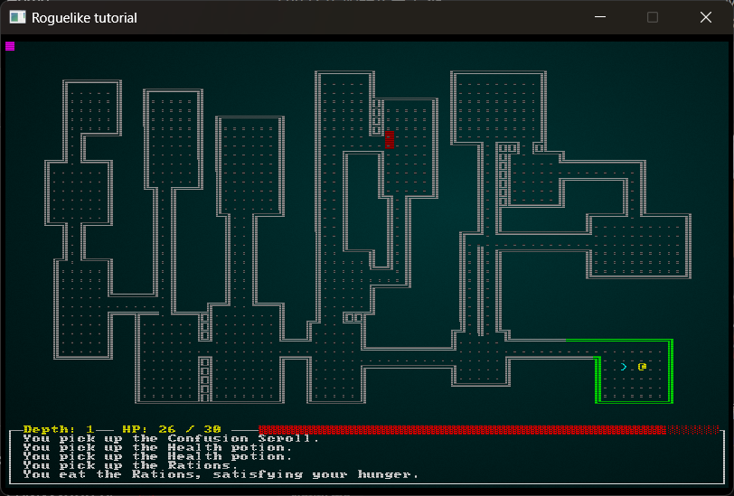

Simple roguelike game in Rust + RLTK, based on [Roguelike Tutorial - In Rust](https://bfnightly.bracketproductions.com/rustbook/chapter_0.html).

# How to run

* `cargo run --release`

# Controls

## Movement

* `W` or `Num 8` - up
* `A` or `Num 4` - left
* `D` or `Num 6` - right
* `X` or `Num 2` - down
* `Q` or `Num 7` - left-up
* `E` or `Num 9` - right-up
* `Z` or `Num 1` - left-down
* `C` or `Num 3` - right-down

## Inventory

* `S` or `Num 5` - pick up items
* `I` - open inventory
* `R` - open drop menu
* `U` - open unequip menu

## Other

* `Space` - rest / skip turn
* `.` - go to the next level
